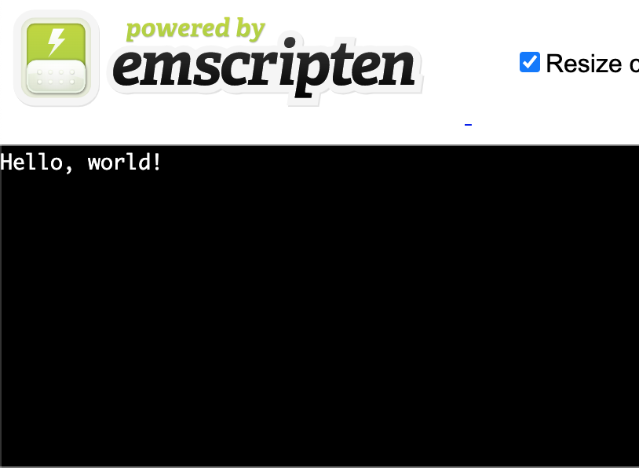
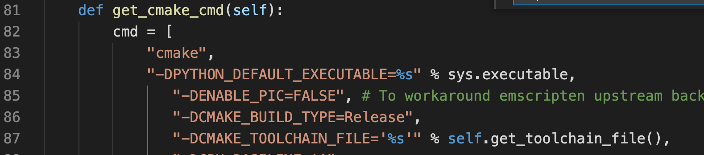
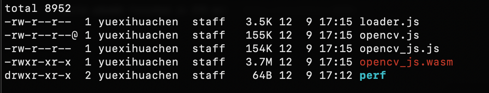

# custom build OpenCV.js

- OpenCV是一个强大的计算机视觉库，可让访问许多基本和高级的图像处理操作。
- OpenCV支持Javascript和WebAssembly构建，我们可以在Web应用程序中使用OpenCv。

---
先决条件
---

确保本地安装了git、cmake 和 python (>= 2.7)
```javascript
$ sudo apt install git
$ sudo apt install cmake
$ sudo apt install python
```

---
设置Emscripten
---
- Emscripten是一个LLVM-to-JavaScript的编译器。我们将使用Emscripten来构建OpenCV.js。
- 创建一个新的目录来安装Emscripten

```javascript
$ mkdir build-opencv

$ cd build-opencv/

$ git clone git@github.com:emscripten-core/emscripten.git

$ cd emsdk/
$ ./emsdk install latest
$ ./emsdk activate latest
$ source ./emsdk_env.sh
```

---
Emscripten测试
---
- 确保Emscripten安装正确，创建一个新目录hello并创建然后编译一个hello.c文件

```JavaScript
$ mkdir hello
$ cd hello
$ cat << EOF > hello.c
#include <stdio.h>
int main(int argc, char ** argv) {
  printf("Hello, world!\n");
}
EOF
# compile
$ emcc hello.c -o hello.html

# run the emrun webserver included in the Emscripten SDK
$ emrun --no_browser --port 8080 .
```
- 现在可以访问http://localhost:8080看到 hello world 输出


- 现在我们可以编译openCV的WebAssembly版本

---
获取openCV
---
- 回到build-opencv目录，并从Github下载最新的openCV
```
$ git clone git@github.com:opencv/opencv.git
```
- 我们使用的是OpenCV 4.5.4

---
删除不需要的模块
---

- openCV默认包括了很多功能，例如深度神经网络（DNN），我们在web中不是最佳的选择，所以我们移除DNN模块
- 打开文件 **opencv/platforms/js/build_js.py**，找到函数**get_cmake_cmd(self):** 设置 **DNN Module**为 OFF



::: tip
我们移除了不需要用到的模块，减小了构建文件的大小，也可以根据自己需要的功能自定义处理不需要的模块
:::
- 默认情况下我们构建出来的是一个包含了webassembly文件的opencv.js的文件，如果需要单独构建.wasm文件，我们需要打开文件**opencv/modules/js/CMakeLists.txt** 找到这行
```
-set(EMSCRIPTEN_LINK_FLAGS "${EMSCRIPTEN_LINK_FLAGS} -s MODULARIZE=1 -s SINGLE_FILE=1")
```
删除 **-s SINGLE_FILE=1** 后
```
set(EMSCRIPTEN_LINK_FLAGS "${EMSCRIPTEN_LINK_FLAGS} -s MODULARIZE=1")
```

---
构建
---
-- 要构建WebAssembly版本，附加 **--build_wasm** 标志
```
# 进入opencv目录
$ cd opencv/

# 开始build
$ python --build_wasm ./opencv/platforms/js/build_js.py build_js --build_wasm
# 或者指定emscripten目录
$ python platforms/js/build_js.py build_out --emscripten_dir /Users/yuexihuachen/Documents/project/emsdk/upstream/emscripten --build_wasm --clean_build_dir
```
- 如果一切顺利，开始构建一段时间后，会收到以下消息
```
===== Build finished =====
OpenCV.js location: /Users/yuexihuachen/Documents/project/opencv/build_out/bin/opencv.js
```
- 进入build_out我们看到的结果

